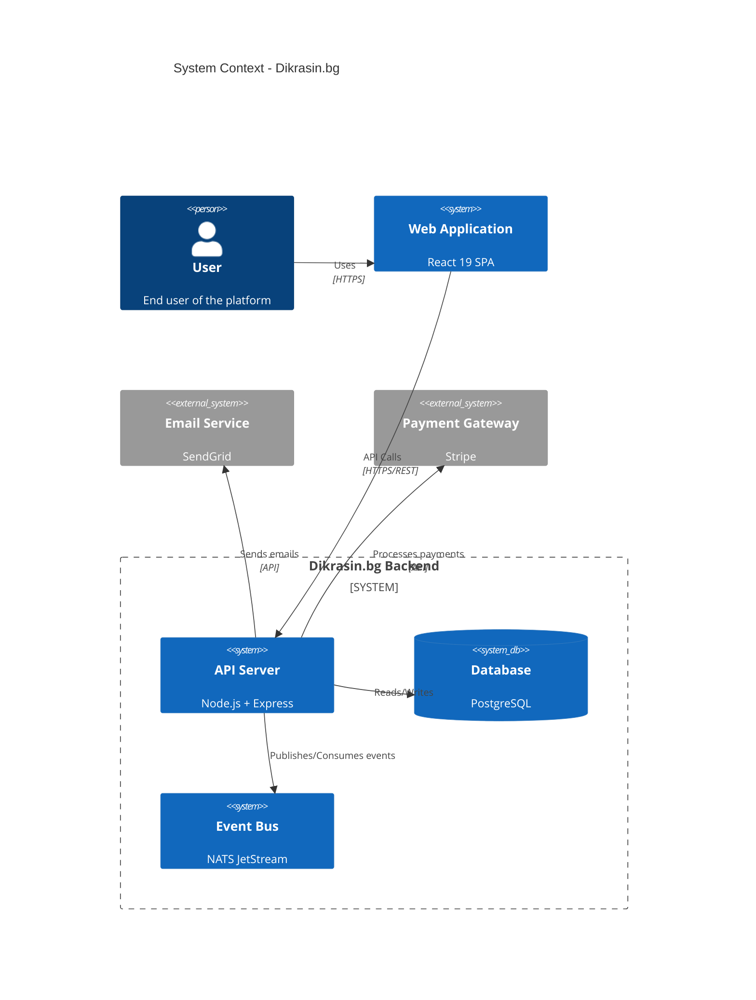
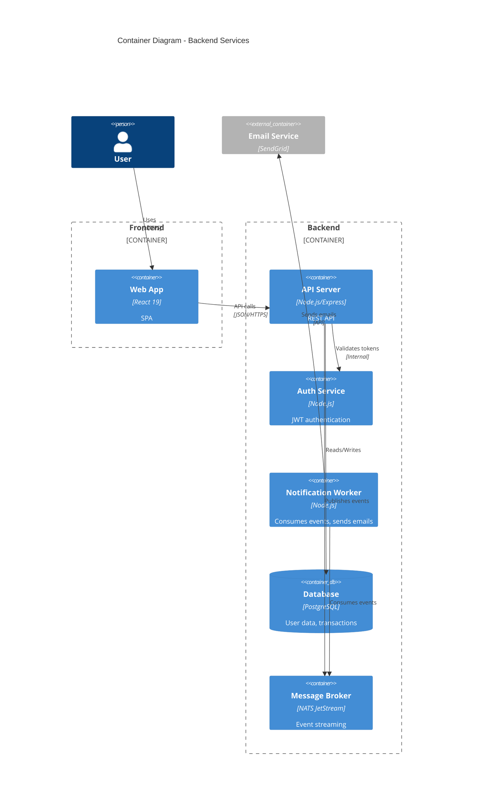
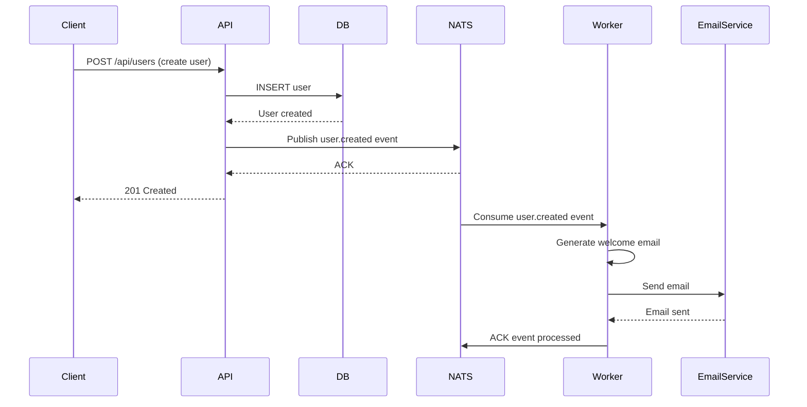
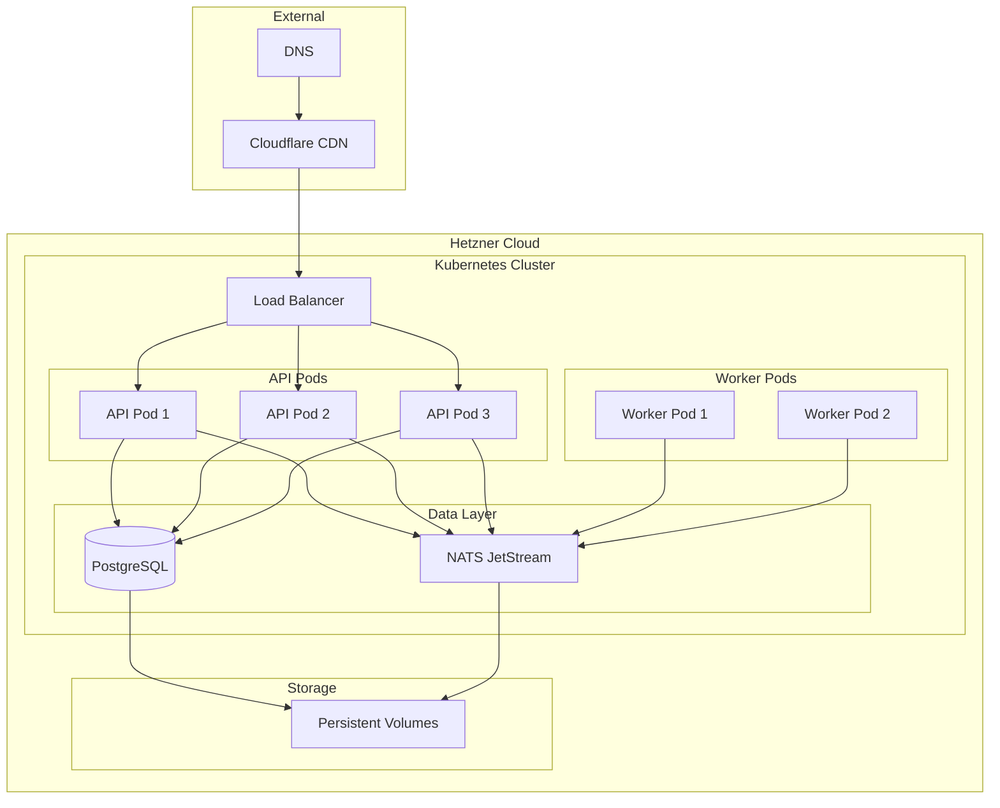
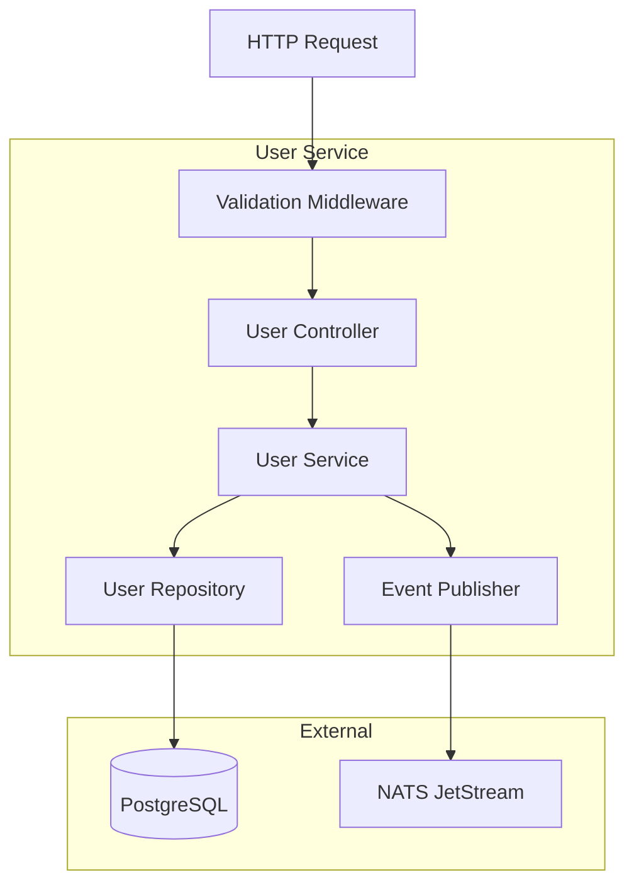
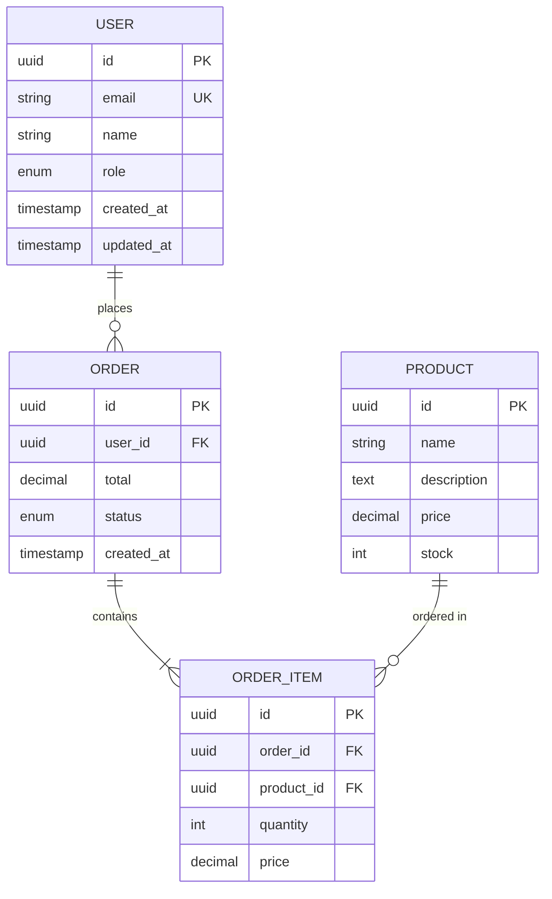
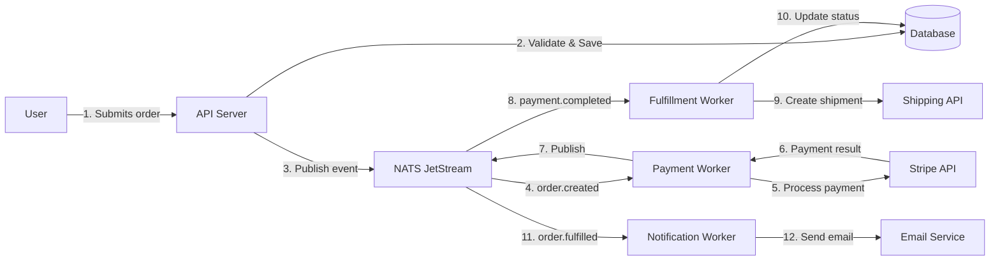
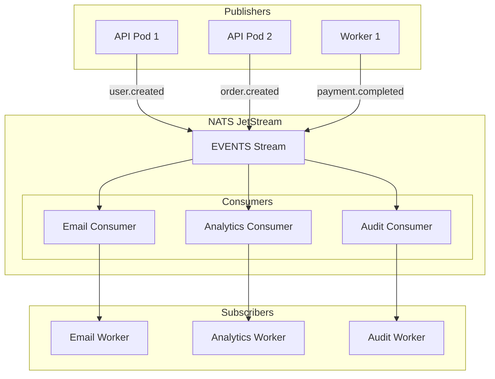
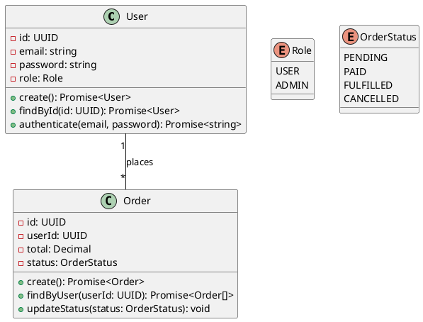

# Architecture Diagram Generation

Generate architecture diagrams and system documentation for event-driven applications.

## When to Use

- Documenting system architecture
- Creating technical diagrams
- Visualizing data flows
- Planning new features
- Onboarding new team members
- Architecture decision records (ADRs)

## Tech Stack Context

- **Architecture**: Event-driven, NATS JetStream
- **Backend**: Node.js + Express + TypeScript
- **Frontend**: React 19 + TypeScript
- **Infrastructure**: Kubernetes on Hetzner Cloud
- **Diagrams**: Mermaid, PlantUML, Excalidraw

## Instructions

When creating architecture documentation:

1. **Diagram Types**:
   - **System Context**: High-level overview (C4 model level 1)
   - **Container**: Services, databases, message queues (C4 level 2)
   - **Component**: Internal structure of services (C4 level 3)
   - **Sequence**: Event flows, API interactions
   - **Deployment**: Infrastructure and hosting
   - **Data Flow**: How data moves through system
   - **ER Diagram**: Database schema

2. **Diagramming Tools**:
   - **Mermaid**: Text-based, version-controllable, renders in GitHub
   - **PlantUML**: More features, UML-focused
   - **Diagrams.net (draw.io)**: Visual editing
   - **Excalidraw**: Hand-drawn style, collaborative

3. **C4 Model Approach**:
   - **Level 1** (Context): System + users + external systems
   - **Level 2** (Container): Apps, databases, message brokers
   - **Level 3** (Component): Classes, modules within containers
   - **Level 4** (Code): Implementation details (rarely needed)

4. **Event-Driven Patterns**:
   - Show event publishers and consumers
   - Indicate event subjects/topics
   - Document event payloads
   - Show retry and error handling
   - Illustrate eventual consistency

5. **Best Practices**:
   - Keep diagrams simple and focused
   - Use consistent notation
   - Include legends
   - Version control diagrams (text-based when possible)
   - Keep diagrams up to date
   - Link from code to diagrams

## Mermaid Diagrams

**System Context (C4 Level 1)**:


**Container Diagram (C4 Level 2)**:


**Event Flow Sequence**:


**Deployment Diagram**:


**Component Diagram (User Service)**:


**Entity Relationship Diagram**:


**Data Flow Diagram**:


**NATS JetStream Architecture**:


## PlantUML Examples

**Class Diagram**:


## Architecture Decision Record (ADR)

```markdown
# ADR-001: Use NATS JetStream for Event-Driven Architecture

## Status
Accepted

## Context
We need an event streaming platform for decoupling services and enabling event-driven architecture. Requirements:
- At-least-once delivery guarantees
- Message persistence
- Consumer acknowledgments
- Stream replay capabilities
- Low operational overhead

## Decision
Use NATS JetStream as our event streaming platform.

## Consequences

### Positive
- Lightweight compared to Kafka
- Built-in persistence and replay
- Easy deployment (single binary)
- Lower resource requirements
- Native Kubernetes support

### Negative
- Smaller ecosystem than Kafka
- Less mature for very high throughput (> 1M msg/sec)
- Fewer managed hosting options

## Alternatives Considered
1. **Apache Kafka**: More mature but higher operational complexity
2. **RabbitMQ**: Not designed for event streaming
3. **Redis Streams**: Limited persistence guarantees

## Implementation
- Deploy NATS JetStream on Kubernetes
- Use durable consumers for all workers
- Implement dead letter queue for failed messages
- Monitor consumer lag via metrics
```

## Example Tasks

- "Create system context diagram"
- "Document event flow for user registration"
- "Generate deployment architecture diagram"
- "Create ER diagram for database"
- "Document microservices architecture"
- "Write ADR for technology choice"

## Tools Setup

**Mermaid CLI**:
```bash
npm install -g @mermaid-js/mermaid-cli

# Generate PNG from mermaid file
mmdc -i diagram.mmd -o diagram.png

# Generate SVG
mmdc -i diagram.mmd -o diagram.svg
```

**PlantUML**:
```bash
# Install (requires Java)
brew install plantuml

# Generate diagram
plantuml diagram.puml
```

## Output Format

Provide complete diagrams in Mermaid or PlantUML format, with explanations of architecture decisions and relationships between components.
